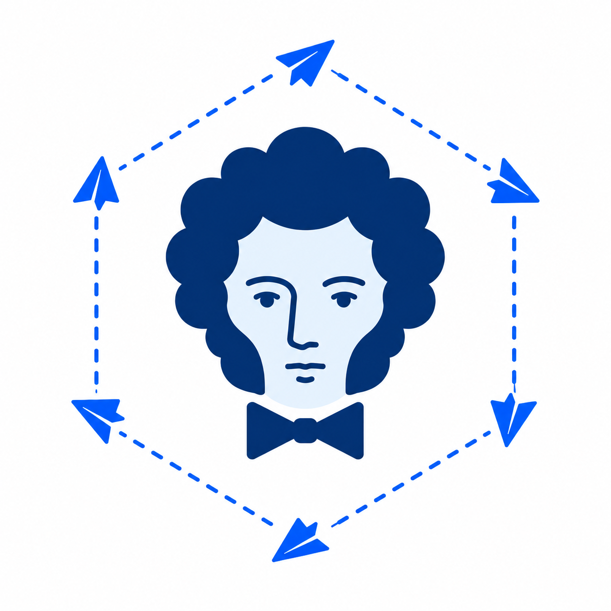

<p align="center">
  
</p>

# Pushkin

**Pushkin** — self-hosted платформа для доставки мобильных push-уведомлений.
Она принимает команды от внутренних систем компании, управляет кампаниями и
доставляет уведомления через Firebase Cloud Messaging (FCM) для Android и iOS.

## Возможности

- Мультиарендная модель: tenant, channel, provider и mobile application.
- Регистрация, обновление и деактивация push installations.
- Кампании с импортируемой аудиторией до 5 000 пользователей в одном batch,
  а также inline-кампании для аудитории до 100 пользователей.
- Отложенный запуск, приоритеты `critical`, `high`, `normal`, ретраи и
  агрегированный прогресс кампании.
- Синхронизация минимальной проекции пользователей из Kafka.
- Inbox пользовательских уведомлений с cursor pagination и TTL 90 дней.
- At-least-once доставка до провайдера: после неопределённого сетевого сбоя
  возможна редкая повторная отправка.

## Архитектура

Сервис написан на Go и следует разделению на domain, application и adapters.
Control plane доступен через HTTP API, а delivery pipeline выполняется через
Kafka. PostgreSQL хранит управляющие сущности, Redis участвует в rate limiting,
Cassandra хранит inbox, а FCM выступает delivery provider.

Подробности:

- [Спецификация v1](SPECIFICATION.md) — продуктовые границы, модель данных,
  жизненный цикл кампаний и эксплуатационные требования.
- [Архитектура кода](ARCHITECTURE.md) — слои, зависимости и pipeline доставки.
- [OpenAPI 3.0 contract](api/http/v1/openapi.yaml) — полный HTTP API.

## Быстрый старт

Для локального запуска нужны Docker с Docker Compose и Go 1.27+ для запуска
тестов и инструментов разработки.

```bash
cp .env.example .env
docker compose up --build
```

Compose поднимает PostgreSQL, Kafka, Redis, Cassandra, миграции, Fake FCM и
сам Pushkin. В локальном окружении сервис доступен по адресу
`http://localhost:8080`; Fake FCM слушает `http://localhost:8081`.

Проверить готовность HTTP-сервера:

```bash
curl -i http://localhost:8080/health
```

Для остановки окружения используйте `docker compose down`. Добавьте `-v`, если
нужно также удалить созданные Docker volumes и локальные данные.

> `.env` содержит настройки локального окружения. Не добавляйте в репозиторий
> реальные API keys, FCM credentials, ключ шифрования или production DSN.

## Разработка и проверка

```bash
go test -race ./...
go vet ./...
```

Интеграционные тесты запускают изолированные Testcontainers-окружения:

```bash
go test -race -tags=integration ./internal/infrastructure/postgres
go test -race -tags=integration ./internal/infrastructure/kafka
go test -race -tags=integration ./internal/infrastructure/redis
```

## API и интеграции

HTTP API имеет префикс `/api/v1`. В нём есть создание и запуск кампаний,
управление provider-ами, channels и mobile applications, регистрация устройств
и чтение inbox. Аутентификация tenant-запросов выполняется API key; внутренние
операции provisioning используют отдельный master key.

Внешние события пользователей читаются из Kafka topic
`pushkin.user-events.v1`. Формат и правила partitioning описаны в
[Kafka-контракте](api/kafka/v1/user_events.go).

## Развёртывание

Материалы для self-hosted Kubernetes-развёртывания находятся в
[`deploy/kubernetes/self-hosted`](deploy/kubernetes/self-hosted). Перед
production-запуском передавайте секреты через Kubernetes Secret или внешний
secret manager и настройте реальные FCM credentials.

## Лицензия

Лицензия пока не определена.
